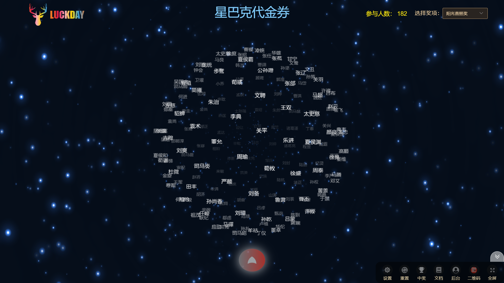
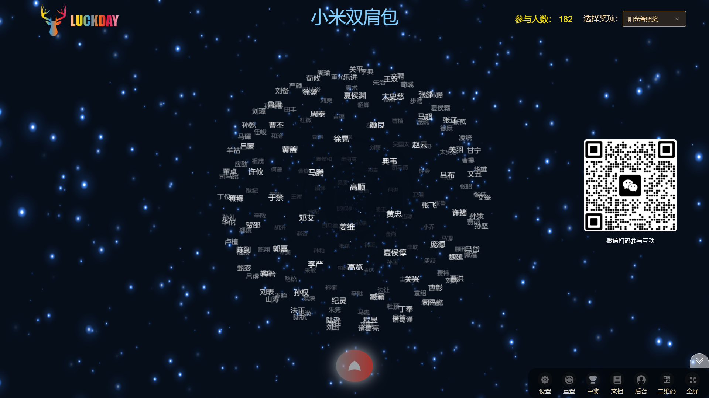
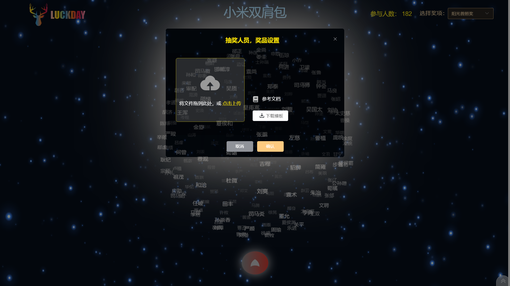
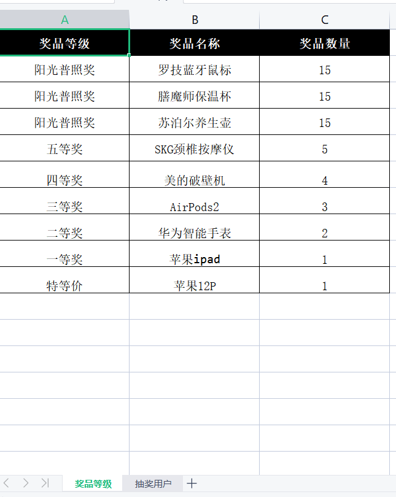
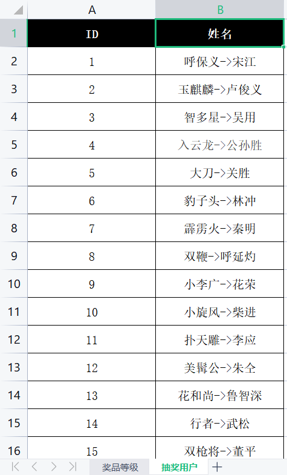
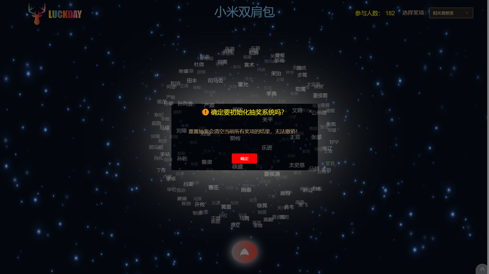
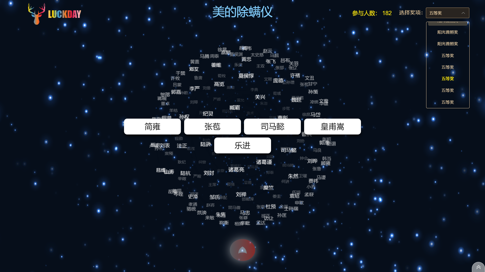
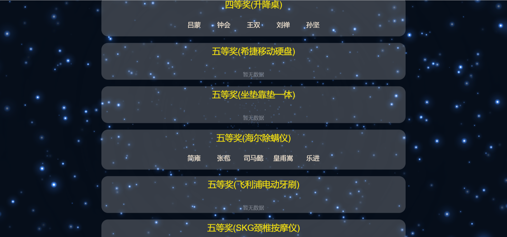

### 免费年会抽奖系统 - 星空

> 星空抽奖 OR 巨幕抽奖 区别：

> 1、星空抽奖不依赖后端服务器，不需要考虑网络宽带等不稳定因素，只需首次加载出来抽奖界面，并按要求设置奖品，抽奖人员即可。

> 2、数据存储在浏览器本地存储空间，抽奖途中，不小心误操作关闭浏览器，数据不会丢失。（注：强制清空本地存储空间除外）

### 演示地址

> http://view.luckday.cn

> 二维码设置开启

### 抽奖设置页面

> 下载 excel 模板，并按照格式设置奖品等级，抽奖名单，设置完成后，上传并确认

> 奖品等级，奖品名称，奖品数量填写

> 抽奖人员编码 ID，姓名填写

### 重置清空抽奖数据

> （注：慎重操作，确认之后所有中奖名单将全部清空）

### 中奖页面

> 中奖名单

> 中奖名单循环轮播滚动

### 登录页面

> 登录地址：http://admin.luckday.cn

> 账号：luckday 密码：123456

